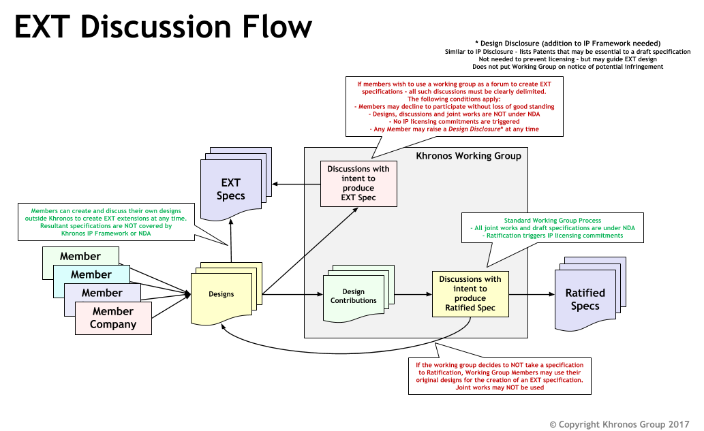

// Copyright (c) 2014-2023, The Khronos Group Inc.
//
// SPDX-License-Identifier: CC-BY-4.0

= OpenXR™ Working Group Extension Processes
:data-uri:
:icons: font
:toc2:
:toclevels: 3
:max-width: 100
:numbered:
:doctype: book
:imagewidth: 800
:fullimagewidth: width="800"

Extensions are a method for runtimes or API layers to expose groups of
functionality upon opt-in by the application.
To help understand how OpenXR extensions are created and supported, this
document describes the various processes for creating, supporting,
promoting, and retiring extensions.

This document is intended to be read in conjunction with the OpenXR style
guide.

== Extension Names and Types

There is a rigid syntax for extension names: `XR_<__author__>_<__name__>`,
where `<__author__>` is a placeholder for a vendor identifier, as described
below.
The `<__name__>` portion is a concise name describing the purpose or
functionality of the extension.
The underscore (`_`) character is used as a delimiter between words.
Every character of the *name* must: be in lower case.

OpenXR extensions fall into three categories:

* Khronos Extensions : Containing `KHR` in their name as the vendor.
** Working group products, subject to ratification and under the IP
   framework, and thus requiring conformance tests.
** The working group may choose to release an extension, developed within
   the Khronos OpenXR IP Zone, as "provisional" to seek feedback.
   Such an extension may be published with a different extension author
   (e.g. `KHX`) to clearly indicate the provisional status.
* Vendor-specific Extensions : Contains some vendor name as an author prefix
** Not a working group product, not ratified, and not subject to the IP
   framework.
** Developed outside of the working group: may be by Khronos member
   companies or non-members.
** Vendor names must be registered author IDs and comply with the rules in
   the style guide.
** Examples could include:
*** ARM - `XR_ARM_...`
*** Google - `XR_GOOGLE_...`
*** Oculus - `XR_OCULUS_...`
** In general, vendor extensions have no explicit compatibility guidelines,
   guarantees, or availability.
   However, at their option, a vendor (or group of vendors, see below) may
   identify experimental extensions with an author ID ending in X. It is the
   discretion of that vendor what this implies, but typically indicates a
   temporary or in-development extension, and may imply removal from future
   implementations or a requirement to activate a "developer" setting or
   similar.
   A revision of an experimental extension has no requirements regarding
   compatibility with its earlier revisions.
* Multi-vendor Extensions : Identified by the `EXT` vendor in their name
** These are vendor extensions that have contributions and agreement from
   multiple vendors.
** Just as with single-vendor extension: not a working group product, not
   ratified, and not subject to the IP framework.
** Developed outside of the working group: may be by Khronos member
   companies or non-members.
** If a multi-vendor extension is proposed as provisional, experimental, or
   preview, its author/vendor identification is `EXTX`.
** **Note:** Working group approval is required before publication for
   naming review because `EXT` is a shared namespace.

[NOTE]
.Note
====
All vendor IDs are clearly identified in the OpenXR registry (xr.xml)
====

== Typical Extension Process Flow

The typical extension process can be best described in the following way:

One company thinks of a new feature and creates their own vendor-specific
extension.
At some point, if they desire, the company reveals the extension to members
of the OpenXR Working Group (WG).

If multiple companies agree on the design, they can choose to create an
`EXT` extension that will be supported by multiple companies.
When creating the `EXT` extension, separate discussions must: occur outside
of the Khronos IP-Zone.

If a majority of companies within the working group desire to cooperate on
making the functionality more consistent across the OpenXR API, they can
discuss creating a new version of the extension as a Khronos extension with
the `KHR` prefix.

**Important:** Extensions must: not be drafted with a KHR name other than
during Working Group business intended to develop an extension for
ratification.
When in doubt, draft extensions with a vendor-specific name.

[NOTE]
.Note
====
The originating company could still release their original vendor-specific
extension (prior to taking design contributions from the WG) if they desire
to get it out in a timely manner.
If everyone likes the direction, they can create a KHR extension.
====

Sometimes, multiple companies may come up with differing ideas of how to
implement a given feature.
Often, this will result in multiple vendor-specific extensions.
It is preferable to cooperate and create either `EXT` or `KHR` extensions
whenever possible since developers prefer to use common extensions.

It is also possible that the OpenXR working group could create a new
extension without any precedence.
When this occurs, the extension is released directly as a `KHR` extension.

At the working group's discretion, an extension may be released in a
"provisional" state.
For experimental/provisional extensions developed within the Khronos IP
Framework (intended to become a `KHR` extension), the associated notice
period and ratification is still required.
A provisional extension is encouraged to use a modified author prefix, such
as `KHX`, to indicate the experimental and temporary status.

A graphical view of the extension discussion flow can be seen in the
following picture:

=== Creating Extensions During Khronos Discussions

As shown in the above image, Khronos extensions belong in the Khronos IP
zone and all other extension types exist outside of the Khronos IP zone.
Khronos extensions, therefore, may be freely discussed and designed at any
time within Khronos.
However, because all other extensions are outside of the Khronos IP zone,
detailed design discussions within Khronos of these extensions should: occur
outside of Khronos email lists and/or meeting times.
If a non-KHR extension's design is discussed during any of these, the
discussion must: be clearly segregated and preceded by an indication that
the following discussion is on an extension that will not be part of Khronos
IP.
There is a "Vendor Extension" label on Khronos GitLab to distinguish issues
and merge requests regarding such discussions outside the IP zone.
It is preferable to avoid talking about those types of extensions within
Khronos whenever possible.

=== Flags

Extensions sometimes need to define new flag bits.
Only KHR extensions and core specification revisions may allocate new flag
bits from existing KHR or core flags fields.
Vendor or EXT extensions should define new flags fields in extension structs
in their namespace from which they are free to assign flag bits.

== Extension Registration Process

Each extension has a unique number used to identify it within the OpenXR
API.
Since there can be multiple authors working on OpenXR extensions
simultaneously, the extension author must: first register the extension with
the OpenXR Working Group.
When registering an extension, the author only provides a minimal amount of
information about their extension to help avoid future spec conflicts.

In an effort to build a more flexible platform, OpenXR allows non-Khronos
developers to extend and modify the API via vendor extensions in the same
manner as Khronos members.
However, extensions must still be registered with Khronos.

Extension authors/vendors should register an author ID with Khronos through
submitting a merge request to the <<openxr-docs,KhronosGroup/OpenXR-Docs>>
project on GitHub.
The author ID must be used for any extensions that author registers.
The same mechanism will be used to request registration of extensions or API
layers with Khronos, as described below.

To reserve an author ID, propose a merge request against `xr.xml`.
The merge must add a `<tag>` XML tag and fill in the `name`, `author` and
`contact` attributes with the requested author ID, the author's formal name
(e.g. company or project name), and contact email address, respectively.
The author ID will only be reserved once this merge request is accepted.
There are requirements on the author ID that must be satisfied, which will
be checked by the specification editor prior to accepting a pull request.
Khronos may decline to register author IDs that are not requested in good
faith.
See the style guide for more details.

[NOTE]
.Note
====
Merge requests on OpenXR-Docs are not accepted directly into the main branch
and published immediately.
Instead, they are accepted into a staging branch which will be merged and
published in conjunction with the next OpenXR patch release.
====

Once an author ID is registered, the rough process for registering an
extension can be split into several steps to accommodate extension number
assignment prior to extension publication:

1. Acquire an extension number.
   * This is done by proposing a merge request against `xr.xml` on the
     `OpenXR-Docs` repository.
   * The merge should add a new `<extension>` tag at the end of the file
     with attributes specifying the proposed extension `name`, the next
     unused sequential extension `number`, the `author` and `contact`
     information (if different than that already specified for the author ID
     used in the extension name), and finally, specifying
     `supported="disabled"`.
     The extension number will be reserved only once this merge request is
     accepted.
     See the <<mr-reserve-extension-number,example>> below.
   * The extension number will be reserved only once this merge request is
     accepted.
   * To accommodate internal development of the specification, the spec
     editor may modify number in the extension reservation when merging it.
     A registration is not official until merged, and the number is not
     guaranteed to be fixed until the registration is released with a patch
     release to the main branch.
2. Develop and test the extension using the registered extension number.
3. Create a second merge request with the completed extension using the
   previously registered extension number, and submit it to the
   `OpenXR-Docs` repository, or the internal Khronos GitLab project at the
   choice of the submitter if they are a member of Khronos.
   * This should include:
   ** The added extension specification source file.
      (Note that in OpenXR, extensions generally do **not** change the prose
      body of the core specification, outside of automatically generated
      content.)
   ** API spec additions to the OpenXR registry file (xr.xml).
   ** Additionally, if any test or example source in the unified internal
     repo tree is affected by the change, those changes may be submitted at
     the same time.
     Otherwise, if submitting to the public GitHub repos, submit SDK, etc.
     changes after publication of the extension in a release, which will
     propagate the `xr.xml` changes to the other repositories.

== Extension Approval Process

The extension approval process starts when a completed extension's merge
request has been properly submitted.
The approval process is important since no extension can be merged into the
OpenXR API Specification until it has been approved by the appropriate
members/companies.
The extension approval process does vary based upon what type of extension
is being submitted, and the differences are pointed out in the following
sections.

Note that all extensions are subject to style and formatting
changes/approval, to ensure a consistent and clear specification document.

=== KHR Extension Approval Process

`KHR` extensions are a special case in the extension approval process
because they must be approved by a majority of the Working Group members.
A `KHR` extension must be developed in full view and with the participation
of the Khronos OpenXR Working Group (WG).
The development of the extension may: occur initially through the use of one
or more OpenXR mailing lists, but must: eventually be discussed during
either a Technical Sub-Group (TSG) conference call, the main Working Group
conference call, or at a Khronos Face-to-Face.
This required visibility is to provide sufficient time for members to
provide their own input as well as evaluate any potential Intellectual
Property (IP) concerns prior to an approval vote.

Typically, one member of the OpenXR WG, or one of the OpenXR TSGs, will
volunteer to *champion* the extension.
The champion is required to document the extension and all concerns as well
as create the final Merge Request to integrate the extension into the
appropriate branch.
Often, the appropriate branch will be the main branch, but this may vary.
This champion should work with all companies interested and address their
concerns about the extension when creating the final merge request.

After the appropriate members feel that the extension has progressed enough,
the champion must: submit the merge request to the Working Group for
approval.
The merge request must: conform to the requirements identified in the
sections above regarding all extension related including the specification
section formatting and contents of the registry (`xr.xml`).

Once the Working group approves of the merge request and the extension, it
must: be submitted to the appropriate group within Khronos for final review
and approval before it can be made available to the public.

Extensions developed within the IP framework (`KHR` and any provisional
designations) must: be developed on the internal Khronos GitLab, and only
merged for publication following complete approval and ratification.

An associated, suitable conformance test is required for full application of
the Khronos IP Framework.
If such a test is not available at the release of the extension, plans
should be made to produce one within a reasonable time frame after release.

=== EXT Extension Approval Process

The process for accepting `EXT` (or `EXTX`) extensions is different than
that of accepting `KHR` (or `KHX`) extensions.

Unlike the `KHR` extension approval process:

1. Only two or more companies need to be involved, and only one of them
   needs to be in the Working Group.
2. The IP is not considered to be Khronos IP, and so discussions during any
   Working Group or Technical Sub-Group time must: be preceded by the
   appropriate disclaimers.
3. Only the companies participating in the development of the `EXT`
   extension need to approve of it prior to creating a merge request.
   * This approval may be determined in whatever method the participating
     companies feel is appropriate.
4. The champion still must create the merge request against the appropriate
   branch.
   * In this case, only the participating companies are responsible for
     approving the merge request before review by the appropriate OpenXR
     Specification editor.
5. To indicate that the `EXT` extension has been approved by the appropriate
   members, the champion, or someone they designate, will submit the merge
   request to the Working Group for approval and indicate that it has been
   approved by all relevant members.
6. The Specification editor must: review the merge request and ensure that:
   * CI does not fail for any reason due to the changes within the merge
     request.
   * There are no pending conflicts.
   * There are no additions to core or KHR bitmasks or other limited-space
     entities (see <<bitmasks>>).
   * The reviewer may: also perform a check of the correctness and style of
     the specification and registry (`xr.xml`) changes.
7. Because `EXT` extensions share a namespace, the usage/assignment of names
   within the extension must: be reviewed and approved by the working group
   prior to merge.
8. Once the editor is satisfied with their simple review, and the working
   group has approved the name usage, they (or someone approved by them to
   perform a merge) merge the merge request into the appropriate branch
   within a reasonable amount of time.
   (This may be a release-specific branch in the internal repo, or a staging
   branch in the public repo.) As mentioned earlier, changes to the
   specification are only considered published once a release contains it
   and it has been merged to the main (default) branch of the public
   OpenXR-Docs repository.

[[bitmasks]]
==== Extending Bitmasks

Vendor and multi-vendor extensions must: not add new bits directly to a core
or KHR bit mask, due to the limited number of bits available to express
functionality.
Only KHR extensions may extend core and KHR bitmasks, and vendors should not
extend each others' extensions' bitmasks but rather collaborate on a
replacement multi-vendor extension to satisfy those requirements.
If the functionality desired is not suitable for a KHR extension, a chained
struct should be used to contain a new bitmask field, instead of adding a
value to the existing one.
Similarly, vendor and multi-vendor `EXT` extensions must: not add to any
other similarly-limited spaces in the spec.
The `XR_SWAPCHAIN_USAGE_INPUT_ATTACHMENT_BIT_MND` bit was added before this
policy was established, and is left as a historical artifact.
See also
https://www.khronos.org/registry/OpenXR/specs/1.0/styleguide.html#extensions-reserving-bitmask-values[the
Style Guide discussion of this].

Regular enums are not subject to this restriction, as a dedicated range in
each enum is assigned to each extension based on extension number.

=== Vendor-Specific Extension Approval Process

Similar to an `EXT` extension, vendor-specific extensions should: not use
OpenXR WG or TSG time and may: be done entirely within the domain of the
company creating the extension.

For vendor-specific extensions, the main process is:

1. The company creating the extension identifies a champion to write up the
   extension merge request.
2. The company determines when they are ready to submit the merge request to
   the OpenXR Specification editor submitting an merge request with
   completed extension's changes.
3. The Specification editor must: review the merge request and ensure that:
   * CI does not fail for any reason due to the changes within the merge
     request.
   * There are no pending conflicts.
   * There are no additions to core or KHR bitmasks or other limited-space
     entities (see <<bitmasks>>).
   * The reviewer may: also perform a check of the correctness and style of
     the specification and registry (`xr.xml`) changes.
4. Once the editor is satisfied with their simple review, they (or someone
   approved by them to perform a merge) merge the merge request into the
   appropriate branch within a reasonable amount of time.
   See above for more information on publication details and timelines.

[NOTE]
.Note
====
If an extension is not intended solely for private use on a company's
particular hardware, runtime or environment, it is recommended that they
disclose the extension to the WG.
This may occur during the step of merge request creation, but may occur at
any point the vendor desires.

This suggestion is based on the fact that other companies may be willing to
collaborate on the design of an `EXT` for common behavior.
`EXT` extensions are preferable for application developers since they are
guaranteed to work across more than one vendor.

However, sometimes a vendor may desire speed over collaboration and should:
not feel pressured into always using the `EXT` path for extensions.
====

== Extension Deprecation Process

Extensions can be deprecated for several reasons:

1. The extension is no longer useful or supported.
2. The extension has been replaced by another extension.
3. The extension functionality has been merged into the core OpenXR API

In the case of either 1 or 2, what could happen is that Runtime vendors will
simply stop exporting support for a deprecated extension at some point in
the future.
This is okay since extensions are optional.
It is recommended that a transition period occur with some kind of warning
indicating that the extension is going away since applications could be
written that depend on it.

However, because released applications could depend on an extension, it is
preferable to support that extension at least until a new version of the
OpenXR API is released.
For example, if an extension is deprecated and it is written as part of
OpenXR 1.0, it is recommended that Runtimes remove support for that
extension no sooner than the release of OpenXR 1.1.

Deprecated extensions will continue to be listed in the OpenXR API, with
some indication that they have been deprecated, until at least the next
Major version bump of the OpenXR API.
This is also the case for extension features that have been merged into the
OpenXR core API (3 above).
In fact, it is recommended that on a major API version increase, that we
re-evaluate all available extensions and determine if they should be removed
from the API.

== Extension Promotion Process

Vendor extensions, if they receive interest and design contributions from
multiple companies following their publication, may be proposed for
promotion to an `EXT` multi-vendor extension.
Similarly, extensions (vendor or multi-vendor) may also be proposed for
promotion to `KHR`.

Any promotion activity should be preceded by design reviews and revision.
Promotions are registered and logically treated as new extensions, and thus
the same review and criteria apply.

Some promotions create new names for values or entry points that should
behave equivalently.
The `xr.xml` registry can express this equivalence in a way that generates
equal values in header files, etc.
This functionality should be used where applicable in promotion processes.

[NOTE]
.Note
====
The Working Group is urged to move carefully and use discretion when
promoting an extension to `KHR` that contains design contributions from
non-member companies.
Such companies have not provided their contributions under the same Khronos
IP Framework and associated licenses that Khronos members do, and thus might
pose a legal/IP risk.
When possible, outside contributors should be encouraged to join Khronos to
ensure equitable licensing, IP, and disclosure terms.
====
