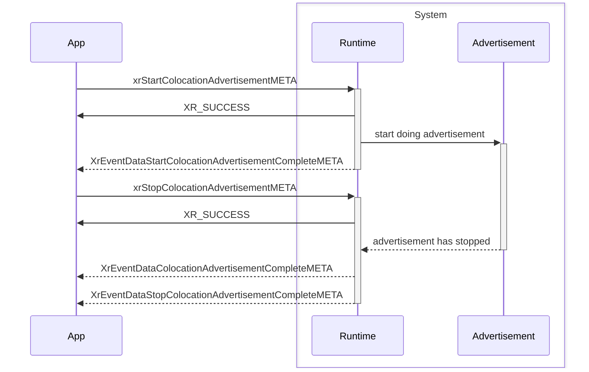
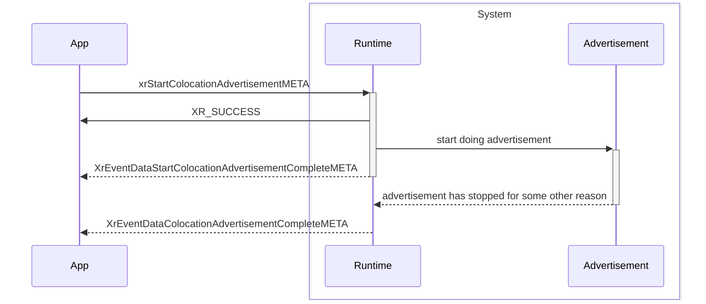
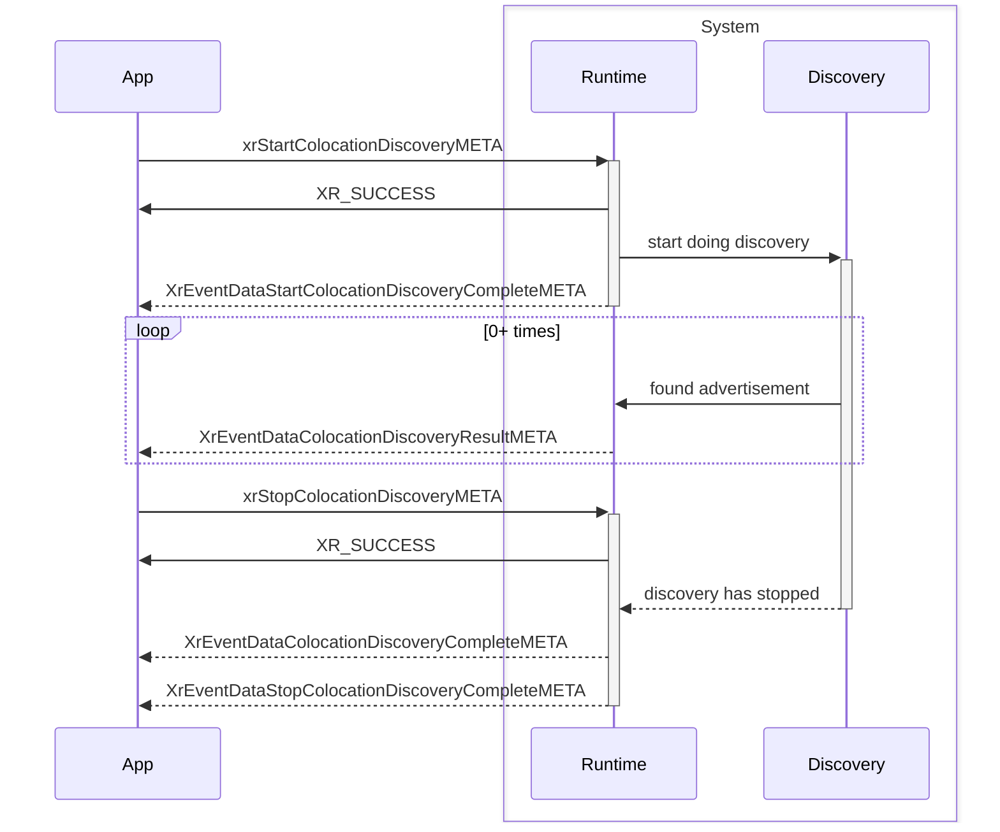
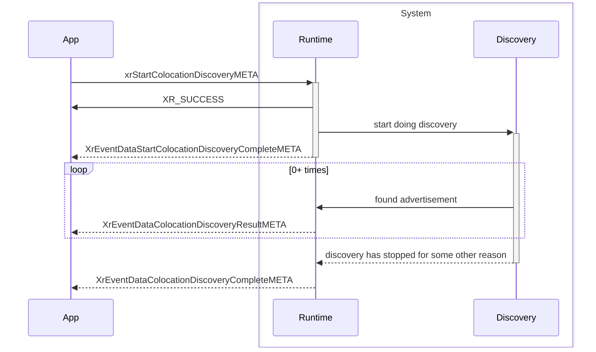

<!--
Copyright (c) 2017-2024, The Khronos Group Inc.

SPDX-License-Identifier: CC-BY-4.0
-->

# Colocation discovery

## Advertisement process - normal

## Advertisement process - runtime needs to stop discovery

## Discovery process - normal

## Discovery process - runtime needs to stop discovery

